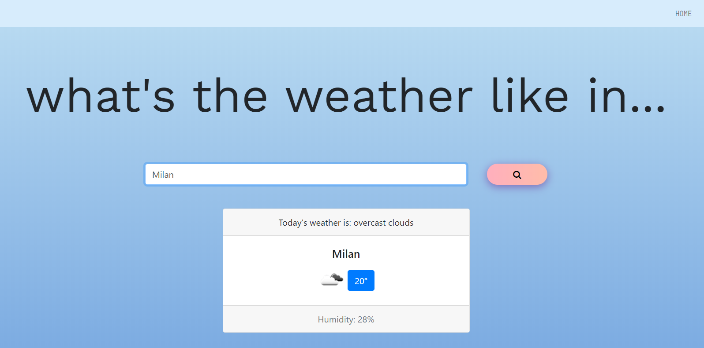

I built this one-page weather app to learn Javascript and jQuery. 
It's hosted on Github Pages and it uses the [OpenWeatherMap](https://openweathermap.org/) API to fetch the current weather data for the city provided by the user.

*Screenshot:*

#### Libraries and frameworks
- Bootstrap CSS 
- [Animate on Scroll](https://michalsnik.github.io/aos/)
